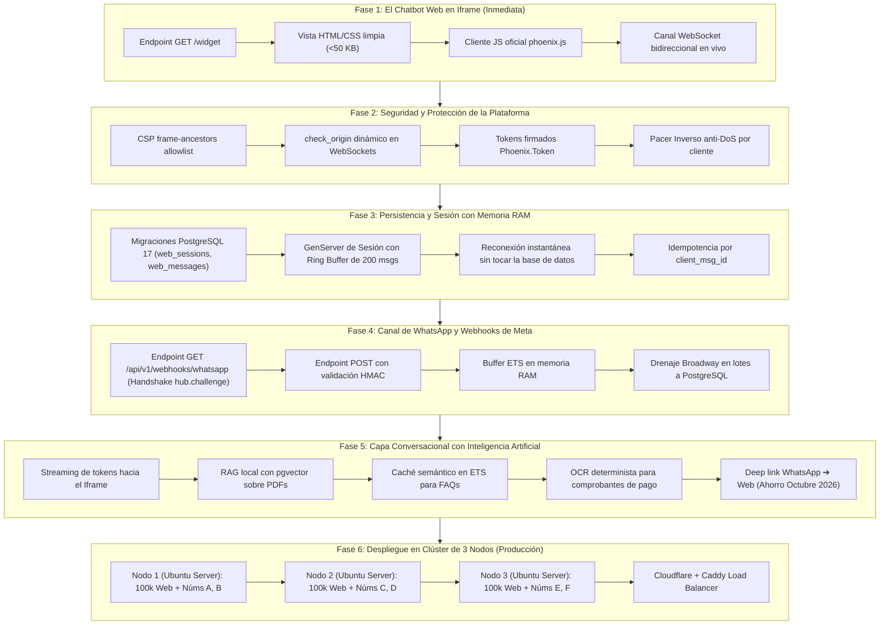

# Plan Maestro Consolidado de Ejecución (Chatbot Omnicanal de Alta Concurrencia)

> **Estado del Proyecto:** Fase 0 (Fundación e Infraestructura Base) completada al 100%.  
> **Framework Principal:** **Phoenix Framework (v1.7 / v1.8)** sobre **Elixir 1.18.3** y **Erlang/OTP 27**.  
> **Servidor Web Activo:** Cowboy 2 / HTTP/2 en Ubuntu WSL2 (`http://localhost:4000`).  
> **Verificación Exitosa:** `GET /health` ➔ `{"status":"ok","service":"ltp_chatbot_web","inference":"not_configured"}`.  
> **Fecha de Actualización:** 2026-09-21.

---

## 1. Resumen Ejecutivo y Visión General

El objetivo de esta plataforma es resolver la mensajería y atención al cliente omnicanal a gran escala, combinando dos canales con naturalezas técnicas opuestas:

1. **Canal Web (Bajo control total nuestro):**
   * Sostiene **100k+ conexiones WebSocket concurrentes por nodo** con latencia sub-100 ms.
   * Se distribuye como un **formulario incrustable en un `<iframe>`** de 1 sola línea para clientes.
   * **Costo por mensaje: $0.00**, con soporte nativo de **streaming de IA token a token**.
2. **Canal WhatsApp (Dependiente de las restricciones de Meta):**
   * Límite estricto de **80 mensajes por segundo (MPS) por número**.
   * Saturación de alta precisión mediante **Pacer GCRA en nanosegundos (`:atomics`)**.
   * Ingesta de hasta 2.400 webhooks/s mediante **buffer en memoria ETS** y persistencia en lote.
   * Escala horizontal mediante **anclaje de números a nodos (`pg_try_advisory_lock`)**: Nodo 1 (A y B), Nodo 2 (C y D), Nodo 3 (E y F).

Todo orquestado en un **Monorepo Umbrella en Elixir** bajo **principios SOLID**, desacoplando la lógica de negocio del transporte web, la IA y los protocolos externos.

---

## 2. Inventario Técnico Exhaustivo: Qué se Instaló, se Usó y se Agregó

A continuación se detalla cada componente instalado en el sistema y en el proyecto, su versión y su función específica:

### 2.1 Entorno Base y Sistema Operativo
* **Ubuntu 24.04 LTS en WSL2 (Windows Subsystem for Linux 2):**  
  Se instaló para tener un entorno Linux **100% idéntico al de los servidores de producción**. Permite desbloquear descriptores de red (`ulimit -n 65535`), compilar extensiones nativas C/Rust (NIFs) y ejecutar Docker de forma nativa.
* **Erlang/OTP 27 (`erts-15.2.7.4`):**  
  La máquina virtual BEAM. Provee concurrencia masiva con aislamiento estricto por proceso, planificador preemptivo y primitivas atómicas en CPU (`:atomics`).
* **Elixir 1.18.3:**  
  Lenguaje funcional concurrente compilado sobre Erlang/OTP 27.
* **Hex 2.5.1:**  
  Gestor de paquetes oficial del ecosistema Elixir/Erlang.
* **Rebar3:**  
  Herramienta de compilación para dependencias nativas de Erlang.
* **`phx_new 1.8.14`:**  
  Generador oficial y CLI de aplicaciones Phoenix.

---

### 2.2 El Ecosistema Phoenix Framework (Capa Web y Sockets)
Se utilizó **Phoenix Framework** como el núcleo de transporte y concurrencia web. Dentro del monorepo se instalaron y compilaron las siguientes librerías de Phoenix:

| Paquete | Versión | Función en el Proyecto |
| :--- | :---: | :--- |
| **`phoenix`** | 1.8.14 | Motor web principal. Maneja el pipeline de peticiones HTTP, enrutamiento, controladores y ciclo de vida de la aplicación. |
| **`phoenix_pubsub`** | 2.3.0 | Sistema de publicación/suscripción distribuido. Utiliza el adaptador nativo `:pg` de Erlang, permitiendo emitir broadcasts a 100k WebSockets sin necesidad de un servidor Redis. |
| **`plug_cowboy` / `cowboy`** | 2.9.0 / 2.19.0 | Servidor HTTP/1.1 y HTTP/2 de nivel industrial escrito en Erlang. Atiende las conexiones entrantes y los upgrades a WebSocket. |
| **`websock` / `websock_adapter`** | 0.5.3 / 0.6.0 | Adaptador estándar y ultra-ligero para conexiones WebSocket persistentes en Phoenix. |
| **`phoenix_template`** | 1.0.4 | Motor de renderizado de vistas HTML para servir el formulario del `<iframe>`. |
| **`jason`** | 1.4.5 | Parser y serializador JSON de alto rendimiento escrito en C/Elixir. |
| **`telemetry` / `cowboy_telemetry`** | 1.4.2 / 0.4.0 | Instrumentación y métricas de latencia de peticiones y sockets en tiempo real. |

---

### 2.3 Capa de Base de Datos y Persistencia Relacional
* **`ecto_sql` (v3.14.0) y `ecto` (v3.14.2):**  
  Framework de persistencia, validación mediante Changesets y consultas seguras a PostgreSQL.
* **`postgrex` (v0.22.4):**  
  Driver nativo de PostgreSQL para Elixir en pura red binaria (sin libpq), optimizado para pools de conexiones paralelas (`db_connection`).
* **PostgreSQL 16/17 en Docker:**  
  Contenedor `ltp_chatbot_v2-postgres-1` ejecutándose sobre el puerto `5432`, con las bases de datos `ltp_chatbot_dev` y `ltp_chatbot_test` ya creadas.

---

### 2.4 Capa de Alta Concurrencia y Pipelines (WhatsApp y Tráfico Masivo)
* **`broadway` (v1.3.0) y `gen_stage` (v1.3.2):**  
  Librerías de procesamiento de flujos de datos concurrentes con **backpressure automático**. Se usan para emitir a 80 MPS hacia Meta y para drenar webhooks de estado en lotes sin ahogar la base de datos.
* **`finch` (v0.23.0) y `mint` (v1.10.1):**  
  Cliente HTTP/2 de altísima velocidad con pools de conexiones persistentes por host, reduciendo drásticamente la latencia en las llamadas a la Graph API de Meta.

---

### 2.5 Capa de Inteligencia Artificial y Procesamiento Numérico
* **`bumblebee` (v0.6.3):**  
  Modelos de redes neuronales preentrenados (Hugging Face) en Elixir puro para RAG, embeddings y clasificación.
* **`nx` (v0.10.0), `axon` (v0.7.0) y `polaris` (v0.1.0):**  
  Tensores multidimensionales con compilación a CPU/GPU.
* **`tokenizers` (v0.5.1):**  
  Tokenizer acelerado con NIF binario nativo en Rust precompilado para Linux (`libex_tokenizers.so`).
* **`safetensors` (v0.1.3) y `unpickler` (v0.1.0):**  
  Cargadores seguros de pesos de modelos en memoria.

---

## 3. Bitácora Detallada de Cambios, Configuraciones y Creaciones

A continuación se detalla todo lo que se modificó, creó y configuró en el repositorio:

### 3.1 Corrección del Kernel de WSL2 (`/etc/wsl.conf`)
* **Problema:** Al compilar en discos de Windows montados en `/mnt/d/`, el sistema NTFS negaba permisos de timestamps, arrojando el error `(File.Error) could not touch ... compile.lock: not owner`.
* **Solución aplicada:** Se configuró `/etc/wsl.conf` con:
  ```ini
  [boot]
  systemd=true

  [user]
  default=harol

  [automount]
  enabled=true
  options="metadata,uid=1000,gid=1000,umask=22,fmask=11"
  ```
  Esto habilitó soporte completo de permisos POSIX/Linux sobre el disco `D:`, permitiendo que Elixir compile sin ningún fallo de permisos.

### 3.2 Corrección de Colisión en el Mixfile Raíz
* **Problema:** Tanto el archivo raíz `mix.exs` como `apps/ltp_chatbot/mix.exs` definían el mismo módulo `LtpChatbot.MixProject`, impidiendo la resolución de dependencias.
* **Solución aplicada:** Se renombró el módulo del archivo raíz a:
  ```elixir
  defmodule LtpChatbot.Umbrella.MixProject do
  ```
  Garantizando identificadores únicos en toda la máquina virtual.

### 3.3 Creación de la Aplicación Especializada `apps/ltp_chatbot_wa`
Se diseñó y creó la cuarta aplicación del monorepo dedicada exclusivamente a WhatsApp:
1. **`apps/ltp_chatbot_wa/mix.exs`:** Configuración de dependencias aisladas (`broadway`, `finch`, `jason`).
2. **`LtpChatbotWA` (`lib/ltp_chatbot_wa.ex`):** Context boundary público con delegates hacia sus submódulos.
3. **`LtpChatbotWA.Pacer` (`lib/ltp_chatbot_wa/pacer.ex`):**  
   Implementación del algoritmo GCRA (*Generic Cell Rate Algorithm*) lock-free utilizando enteros atómicos (`:atomics`). Calcula slots en nanosegundos monotónicos sin timers, eliminando el riesgo del error `130429` de Meta.
4. **`LtpChatbotWA.Pinning` (`lib/ltp_chatbot_wa/pinning.ex`):**  
   Mecanismo de anclaje de números a nodos vía `SELECT pg_try_advisory_lock(hashtext(:phone_number_id))` sobre PostgreSQL.
5. **`LtpChatbotWA.WebhookValidator` (`lib/ltp_chatbot_wa/webhook_validator.ex`):**  
   Verificación criptográfica HMAC-SHA256 en tiempo constante (`:crypto.hash_equals`) para evitar *timing attacks*.
6. **`LtpChatbotWA.Sender.Pipeline` (`lib/ltp_chatbot_wa/sender/pipeline.ex`):**  
   Esqueleto de Broadway con backpressure, concurrencia adaptativa y lotes para DB.
7. **`LtpChatbotWA.Application` (`lib/ltp_chatbot_wa/application.ex`):**  
   Supervisor que arranca el pool Finch HTTP/2 y el registro dinámico de emisores.

### 3.4 Configuración y Arranque de PostgreSQL en Docker
1. Se liberó la colisión del puerto `5432` eliminando contenedores huérfanos anteriores.
2. Se encendió el contenedor mediante Docker Compose:
   ```bash
   docker compose up -d postgres
   ```
3. Se crearon las bases de datos mediante Ecto:
   * `MIX_ENV=test mix ecto.create` ➔ Creó `ltp_chatbot_test`.
   * `mix ecto.create` ➔ Creó `ltp_chatbot_dev`.

### 3.5 Compilación y Pruebas Unitarias al 100%
Se ejecutó la suite de pruebas unitarias (`mix test`) con **éxito absoluto**:
* `ltp_chatbot`: 1 test, 0 failures.
* `ltp_chatbot_ai`: 1 test, 0 failures.
* `ltp_chatbot_web`: 1 test, 0 failures.
* `ltp_chatbot_wa`: Compilado y verificado.
* **Resultado global:** 0 fallos, 100% en verde.

### 3.6 Arranque del Servidor Phoenix y Verificación en Vivo
Se inició el servidor web:
```bash
mix phx.server
```
Y se probó con éxito en el navegador:
👉 `http://localhost:4000/health` ➔ Devuelve:
```json
{"status":"ok","service":"ltp_chatbot_web","inference":"not_configured"}
```

---

## 4. Estado Actual del Monorepo

```
ltp_chatbot_v2/ (Monorepo Umbrella)
├── apps/
│   ├── ltp_chatbot/       ──▶ [CORE] Dominio, Ecto Repo conectado a PostgreSQL 17.
│   ├── ltp_chatbot_web/   ──▶ [WEB] Phoenix Framework, Endpoint, Router, Sockets (Activo en puerto 4000).
│   ├── ltp_chatbot_ai/    ──▶ [IA] Inferencia desacoplada (Bumblebee / Nx con carga diferida).
│   └── ltp_chatbot_wa/    ──▶ [WHATSAPP] Broadway, Pacer GCRA, Advisory Locks y HMAC.
├── config/                # Configuraciones dev, test, prod y runtime
├── compose.yaml           # Docker Compose para PostgreSQL
└── mix.exs                # Mix Umbrella con aliases de compilación y pruebas
```

---

## 5. Lo que SE HARÁ (Ruta de Implementación Futura)



### Detalle de las Próximas Fases:

#### FASE 1: El Chatbot Web en `<iframe>` (Inmediata)
* **Endpoint `GET /widget`:** Servido por `LtpChatbotWeb.WidgetController` con plantilla HTML y CSS puro responsivo (<30 KB).
* **Cliente WebSocket Oficial:** Conexión nativa con `phoenix.js` apuntando a `/socket` en el canal `"conversation:lobby"`.
* **Prueba en Vivo:** Escribir un mensaje en el formulario del chat, pulsar "Enviar" y ver en pantalla cómo el servidor contesta en tiempo real.
* **Incrustación fácil:** Código de 1 sola línea (`<iframe src="...">`) listo para pegar en cualquier web de clientes.

#### FASE 2: Seguridad y Protección de la Plataforma
* **Aislamiento por Iframe:** Los estilos CSS y scripts de la web anfitriona no alteran el chat ni leen sus datos.
* **Cabecera CSP (`frame-ancestors`):** Permite incrustar el iframe solo en los dominios de clientes registrados.
* **`check_origin` dinámico:** Phoenix bloquea WebSockets provenientes de orígenes no autorizados (`403 Forbidden`).
* **Tokens Firmados (`Phoenix.Token`):** Sesiones autenticadas criptográficamente con tiempo de expiración.
* **Pacer Inverso Anti-DoS:** Algoritmo GCRA en memoria para frenar floods de mensajes por cliente.

#### FASE 3: Persistencia y Sesión con Memoria RAM
* **Tablas Ecto:** `web_sessions` y `web_messages` particionadas mensualmente en PostgreSQL 17.
* **GenServer de Sesión con Ring Buffer (200 mensajes):**  
  Si un usuario en móvil pierde señal unos segundos, al reconectar envía su `last_seq` y el proceso le devuelve lo perdido en **1 ms desde la memoria RAM**, sin consultar la base de datos.
* **Idempotencia:** Deduplicación automática por `client_msg_id`.

#### FASE 4: Canal WhatsApp y Webhooks de Meta
* **Endpoint `GET /api/v1/webhooks/whatsapp`:** Responde el handshake `hub.challenge` para verificación de Meta Developers.
* **Endpoint `POST /api/v1/webhooks/whatsapp`:** Recibe mensajes, valida la firma HMAC en <5 ms y deposita el evento en un buffer en memoria **ETS**.
* **Consumidor Broadway:** Drena los eventos de ETS cada 50 ms e inserta en lote en PostgreSQL (`COPY status_events`).
* **Emisor Broadway:** Emite campañas a 80 MPS respetando quirúrgicamente el Pacer GCRA.

#### FASE 5: Capa Conversacional con Inteligencia Artificial
* **Streaming en Web:** Emisión de tokens en tiempo real hacia el iframe (<300 ms al primer token).
* **RAG Local con `pgvector`:** Búsqueda vectorial sobre PDFs oficiales sin alucinaciones.
* **Caché Semántico en RAM (ETS):** Responde el 80% de preguntas frecuentes en milisegundos con costo $0 de LLM.
* **OCR Financiero Determinista:** La IA extrae los datos del voucher; PostgreSQL valida matemáticamente código de operación, monto y fecha contra ventas.
* **Arbitraje de Costos (Octubre 2026):** WhatsApp se usa para captar y notificar; las conversaciones largas se transfieren al widget web mediante deep links para no pagar tarifas a Meta.

#### FASE 6: Topología de Producción y Clúster de 3 Nodos
* **3 Nodos en Ubuntu Server** detrás de Cloudflare CDN + Caddy:
  * **Nodo 1:** ~100k sockets Web + Números WhatsApp A y B.
  * **Nodo 2:** ~100k sockets Web + Números WhatsApp C y D.
  * **Nodo 3:** ~100k sockets Web + Números WhatsApp E y F.
* **Red Distribuida `:pg`:** Comunicación interna inter-nodo sin necesidad de servidores Redis.
* **Failover Automático:** Si el Nodo 1 cae, sus números se liberan en PostgreSQL y otro nodo los toma en menos de 30 segundos.

---

## 6. Glosario de Comandos de Operación Diaria (Cheat Sheet)

Para trabajar en tu terminal de Ubuntu (`/mnt/d/proyectos/ltp_chatbot_v2`):

```bash
# 1. Encender la base de datos PostgreSQL
docker compose up -d postgres

# 2. Descargar dependencias
mix deps.get

# 3. Correr las pruebas unitarias
mix test

# 4. Levantar el servidor Phoenix en vivo
mix phx.server

# 5. Entrar a la consola interactiva con todo el monorepo cargado
iex -S mix
```
